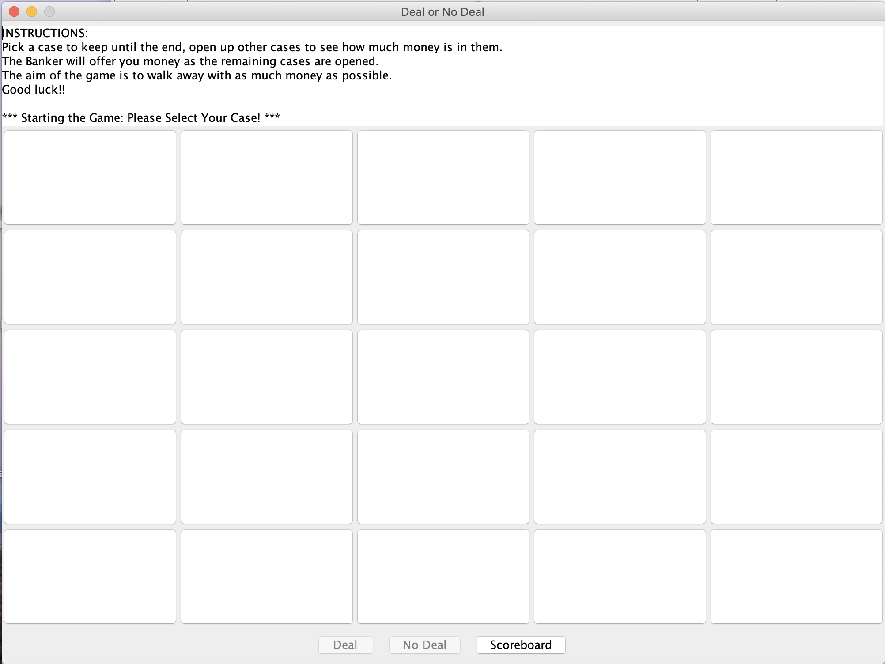
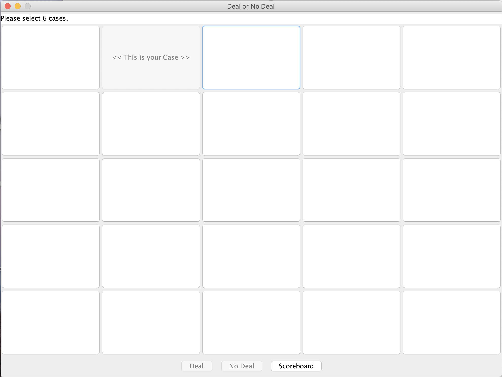
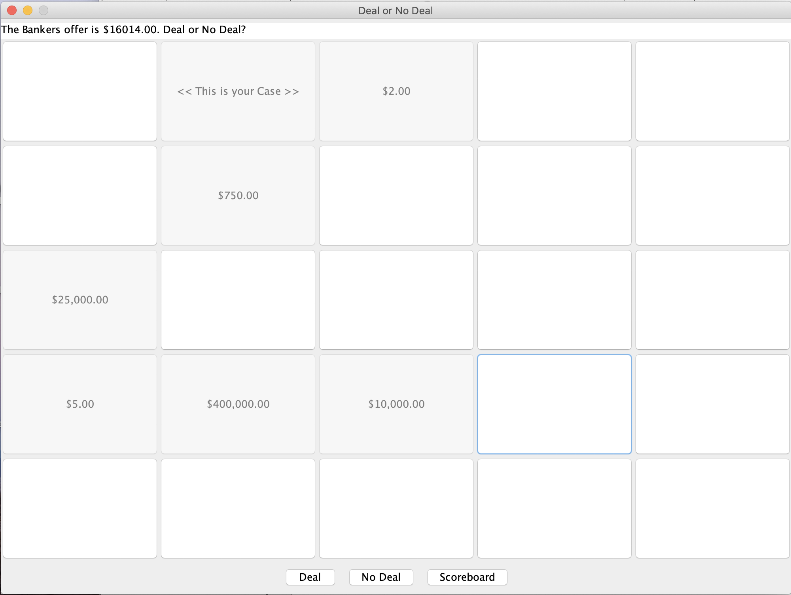
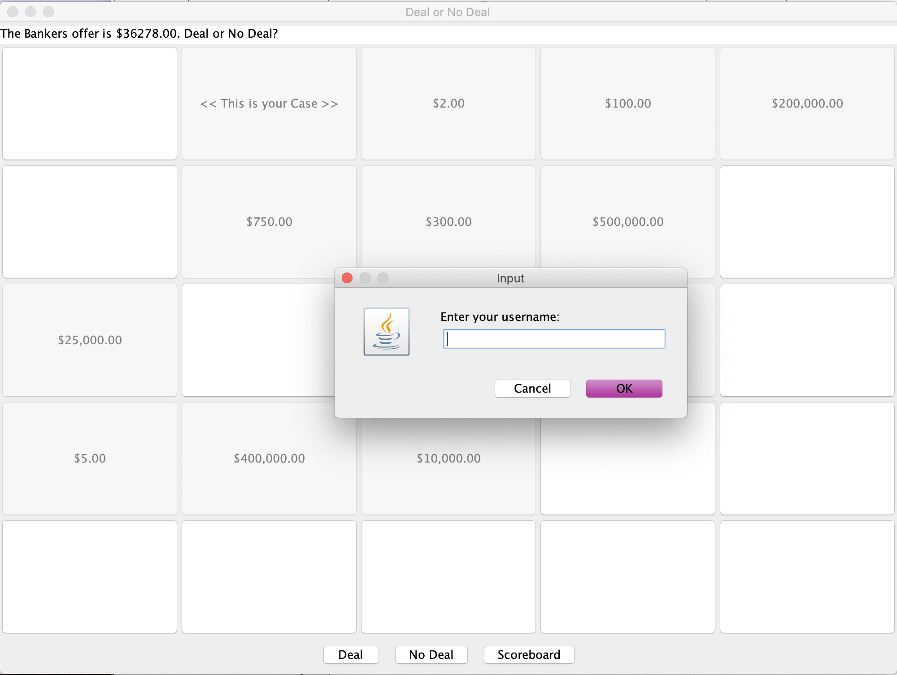
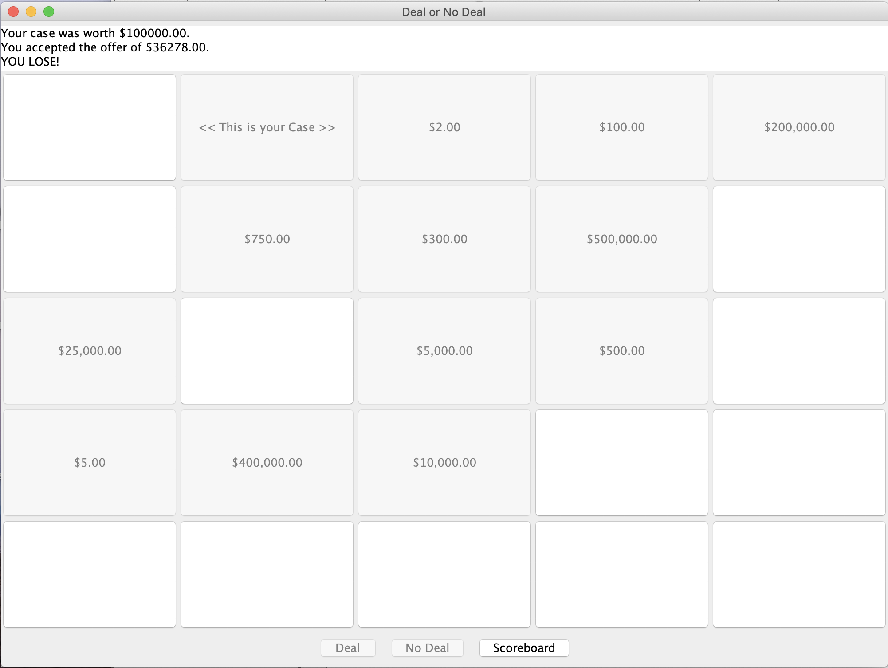
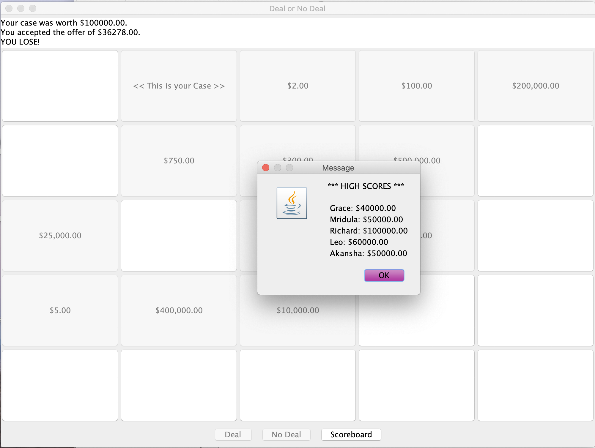
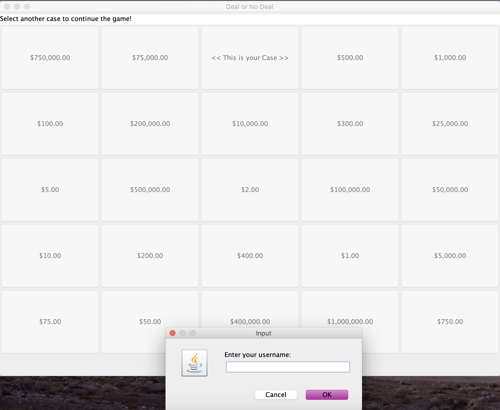
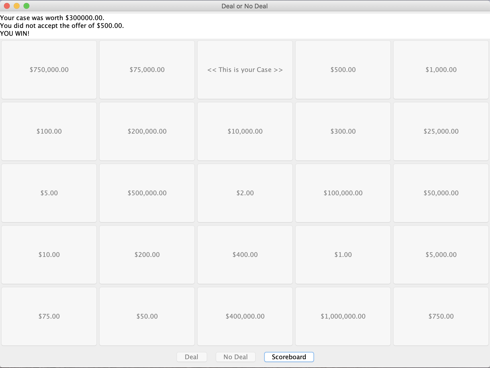

# DealOrNoDealGUI

## Project Description
The purpose of this project was to create a Graphical User Interface (GUI) version of a Deal Or No Deal game. 
The code to create the game needed to be clear, well-designed and follow Object-Oriented Programming practices. The program must have a database element, and must be able to achieve database interactions and operations (input/output). The graphical interface had to be easy for users to interact with, with clear instructions and neat design. The class structure needed to be clear and have an implementation of design patterns. The code should also have set units tests covering important functionality.
Note: This project is a modified version of the DealOrNoDealCLI project found in the same organisation.

## Gameplay

#### *Possible Scenario 1: Accepting an offer, losing the game*

When the game is started a GUI screen will show with basic gameplay instuctions.

The first case is selected by the player, starting the game.

The Banker can offer the player an amount of money, the player can choose to accept(Deal) or decline(No Deal).

Once the player has clicked the button for their decision, the GUI prompts the player for a name for the scoreboard.

In this case, the player has accepted the Bankers offer, but unfortunately the Banker was offering more money than what was in the players original case. The player has lost the game.

Clicking the scoreboard button reveals names and monetary scores of past players, called from the score database.

#### *Possible Scenario 2: Eliminating all cases, rejecting all offers, winning the game*

We can see that the player has eliminated all possible cases in the game, and has rejected all Banker offers to get to this stage of the game. Since there are no cases left to continue the game, the GUI prompts the player for a name for the scoreboard.

 The money in the players case is worth more than the Bankers last offer, so the player has won.
 

## Developers:
- Grace Subianto [(gracesubianto)](https://github.com/gracesubianto)
- Mridula Manderwad [(mmridulzz)](https://github.com/mmridulzz)
